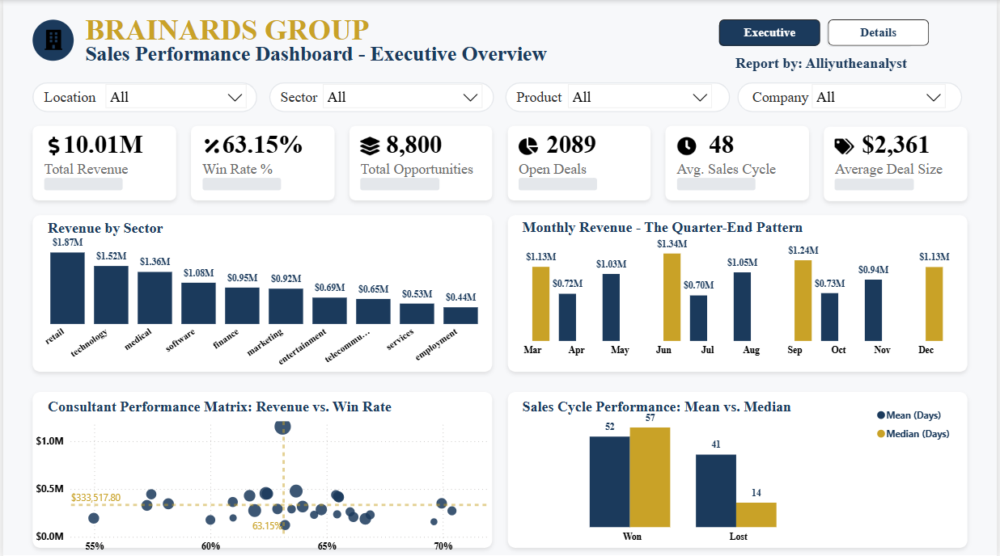
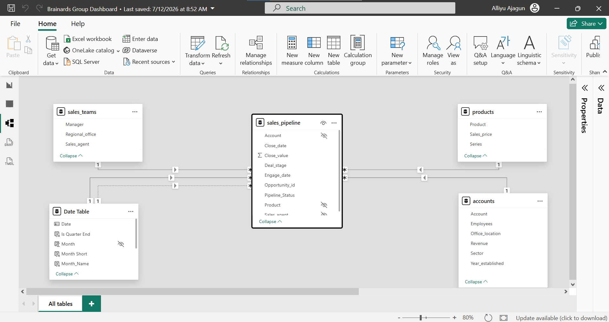
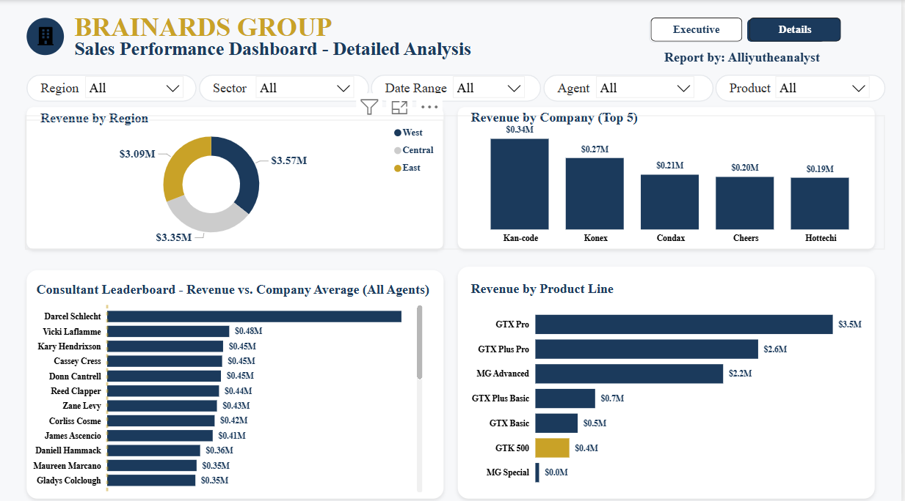

# CRM-Sales-Performance-Analysis-with-Power-BI

Brainards Group had 8,800 sales opportunities scattered across four disconnected CSV exports, with no way to see which sectors, consultants, or regions were actually driving revenue. I modeled the data into a star schema in Power BI and built a two-page executive dashboard. The headline finding: revenue gaps between sectors and regions come from volume of opportunities, not win rate; this means the fix is pipeline generation, not sales coaching. A small cluster of consultants also generates a disproportionate share of revenue, and one product (GTK 500) commands the highest deal value but also the slowest sales cycle.

### The Business Problem

Management had no centralized view of performance and couldn't answer basic questions: which sectors generate the most revenue, which consultants and products perform best, which regional office is strongest, or how efficient the sales pipeline is. Decisions were being made on fragmented reports instead of one source of truth.

### Data & Method

- Source: CRM Sales Opportunities dataset (Kaggle) - 4 related tables: Accounts (85 companies), Products (7), Sales Teams (35 consultants), Sales Pipeline (8,800 opportunities)
- Cleaning: consolidated 4 CSVs in Excel, validated dates, checked duplicates, standardized categorical values, preserved open opportunities with blank close dates
- Modeling: star schema in Power BI with Sales Pipeline as fact table, Accounts/Products/Sales Teams/Date as dimensions; custom DAX date table via CALENDARAUTO()
- Measures: Total Revenue, Win Rate, Average Deal Size, Average Sales Cycle, Won/Lost/Open Opportunities

### Key Insights

- "Retail, Technology, and Medical sectors drive the most revenue because they generate the most opportunities, not because they close at a higher rate"; Win rates were similar across sectors; volume is the real lever.
- "A small group of consultants generates a disproportionate share of total revenue"; performance is concentrated, not evenly spread.
- "GTK 500 has the highest average deal value but also the longest sales cycle"; high-value products take longer to close.
- "Regional win rates are nearly identical, so underperforming regions need more opportunities, not more coaching"- reframes the diagnosis from skill gap to pipeline gap.
- "Sales spike every quarter-end", a recurring seasonal pattern visible in the monthly revenue trend.

### Clear Recommendations

- Increase opportunity generation in the East region - its ceiling is volume, not conversion skill.
- Study and replicate the specific practices of the top-revenue consultants across the wider team.
- Prioritize go-to-market push behind high-value products, while auditing products with unusually low deal values.
- Flag and monitor long-running open opportunities before they stall the pipeline.
- Make the dashboard a standing tool in monthly sales reviews rather than a one-off analysis.

Links: [Live dashboard](https://app.powerbi.com/view?r=eyJrIjoiMGIxY2ExMzEtYTM4ZS00NzBiLWE5ZDQtNGM5MzM2MGI2MDI1IiwidCI6ImI2NDU3ZDY4LTQzODgtNGMzYS04MjIyLTc0ZGU0NDU5ZDFlZiJ9&pageName=9f9f3953b30e7aef0e41) · [Medium case study](https://medium.com/@ajagunalliyu/from-raw-crm-data-to-business-decisions-building-a-sales-performance-dashboard-for-brainards-group-335d53110168?sharedUserId=ajagunalliyu)

### About Me

Hi, I'm **Alliyu Ajagun** known as **Alliyutheanalyst**.

I'm a Data Analyst with a background in Applied Mathematics and a passion for transforming raw data into actionable business insights using Excel, SQL, Python, and Power BI.

I enjoy solving business problems through data visualization, dashboard development, and analytical storytelling.

## Let's Connect
 
> Feel free to reach out: [ajagunalliyu@gmail.com](mailto:ajagunalliyu@gmail.com)  
> Connect with me on [LinkedIn](https://www.linkedin.com/in/alliyuajagun)  
> Follow on [Twitter/X](https://x.com/Sayyid_Alliyu)  
> Read more on [Medium](https://medium.com/@ajagunalliyu)  
> 💻 Explore more projects on [GitHub](https://github.com/ajagunalliyu)
> View [Portfolio website](https://sites.google.com/view/alliyutheanalyst/portfolio?authuser=0)

## ⭐ Support

If you found this project helpful or interesting, consider giving the repository a **star**. Your support helps increase the visibility of my work and encourages me to continue building and sharing data analytics projects.

Thank you for visiting!
